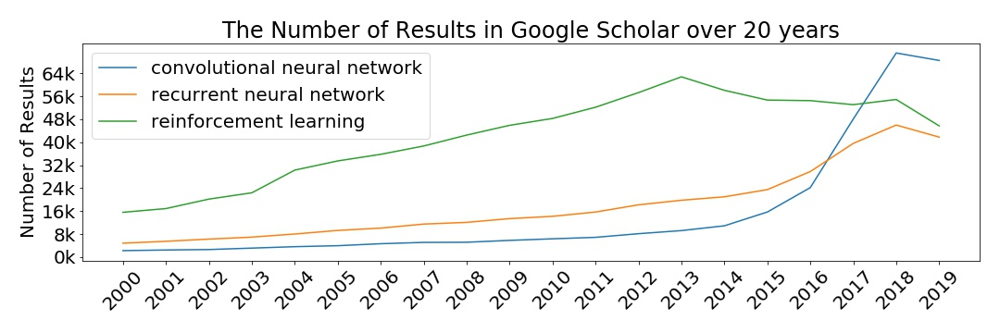
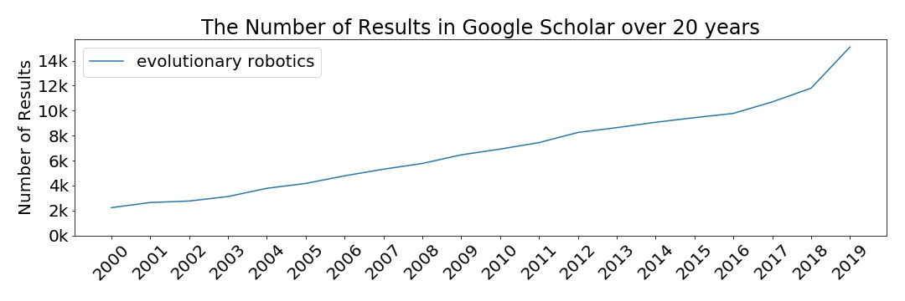

# Google Scholar Trends

Plot the trends of terminologies in Google Scholar over 20 years

For example, let's see the difference between CNN, RNN, and RL:

Compare to the interest of the public in Google Trends:

Another example, let's take a look at Evolutionary Robotics:

# Polite Scraping

Google Scholar does not welcome crawlers, so please be as polite as possible.

Sleep 2 sec after scraping every page and save all results in cache.
